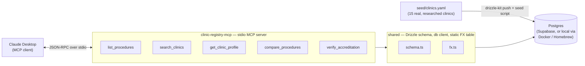

# MediTourBuddy — Clinic Registry MCP

A Model Context Protocol (MCP) server that lets Claude answer real questions about accredited
dental clinics for Canada-outbound medical tourism (Turkey and Mexico, dental vertical v1). Built
as a portfolio piece: the centerpiece is `packages/clinic-registry-mcp`, an MCP server backed by a
Postgres database of real, individually-researched clinics — every accreditation claim carries a
source URL a human can check.

> Informational only — not medical advice. Verify directly with the clinic. (This disclaimer is
> baked into every tool response — see [Guardrails](#guardrails).)

## Demo

_A 30-second GIF of Claude Desktop calling these tools goes here — see
[docs/architecture.md](docs/architecture.md#recording-the-demo-gif) for how to record it once
you've connected the server to Claude Desktop (below)._

## Architecture



Two workspace packages do the work:

- **`packages/shared`** — the Drizzle ORM schema (`clinics`, `accreditations`, `practitioners`,
  `procedures`, `clinic_procedures`, `reviews_summary`), a Postgres client, a static currency
  conversion table (`fx.ts`), and the seed pipeline (`src/seed/`) that loads
  `seed/clinics.yaml` into the database idempotently.
- **`packages/clinic-registry-mcp`** — the MCP server itself. Each tool is a small handler
  function in `src/tools/`, registered on an `McpServer` (`src/server.ts`) and exposed over
  `StdioServerTransport` (`src/index.ts`) — the transport Claude Desktop expects for a local,
  process-spawned server.

`packages/agent` is a phase-2 stub (an orchestrator CLI) — not built yet.

## Tools

All inputs are Zod-validated; every response includes the disclaimer string above, and
price-bearing fields carry a `stale: true` flag once their `last_verified` date is more than 90
days old.

| Tool | Purpose | Key inputs |
|---|---|---|
| `list_procedures` | Reference lookup of the 12 seeded dental procedures, so free-text intake ("redo my whole top row") can be mapped to a `procedure_code`. | `category?` |
| `search_clinics` | Find vetted clinics for a case. Never returns a clinic with zero accreditations when `require_accreditation` is true (the default); sorted by accreditation strength, then price; capped at 10 results. | `procedure_code`, `country?`, `max_budget_usd?`, `language?`, `require_accreditation?` |
| `get_clinic_profile` | Full detail for one clinic: accreditations (with `source_url`), practitioners, priced procedures. | `slug` |
| `compare_procedures` | Cross-clinic USD price comparison for one procedure, optionally against a Canadian quote (`savings_vs_quote_pct`). Currency conversion uses the static table in `packages/shared/src/fx.ts`. | `procedure_code`, `canadian_quote_cad?`, `country?` |
| `verify_accreditation` | The trust tool — returns the evidence chain (`source_url`, `valid_until`, `status`) for a clinic's accreditations, not just a boolean. `status` is `verified`, `expired`, or `unverifiable` (no matching accreditation on file). | `slug`, `body?` |

## Guardrails

- The server returns **information only**. No tool recommends a treatment, interprets symptoms,
  or ranks clinics by clinical outcome — comparison is on price, accreditation, and logistics.
- Every accreditation row carries a `source_url`. No source, no row — enforced at the schema
  level (`accreditations.source_url` is `NOT NULL`) and honored during research: several real
  clinics in the seed data have **zero** accreditation rows because no verifiable claim could be
  found, rather than a fabricated one.
- Stale pricing (`last_verified` > 90 days) is returned with a `stale: true` flag.
- The disclaimer above is included in every tool response.

## Data

15 target clinics (8 Istanbul, 7 Mexico per the original plan); **14 are currently seeded** (7
Istanbul, 5 Los Algodones, 2 Cancún) — every entry is a real clinic, individually researched, with
sources cited inline in [`packages/shared/seed/clinics.yaml`](packages/shared/seed/clinics.yaml).
One Istanbul slot remains open: every further real candidate either duplicated an existing entry
or failed the "no source, no row" bar during research.

## Running it locally

Prerequisites: Node 20+, [pnpm](https://pnpm.io), and a Postgres instance (either Supabase, or a
local one via Docker or Homebrew).

```bash
pnpm install
```

### 1. Point at a database

For Supabase, copy `.env.example` to `.env` and fill in your project's **Session pooler**
connection string (the direct `db.<ref>.supabase.co` host is IPv6-only and won't resolve on most
networks):

```bash
cp .env.example .env
```

For local development/testing, start Postgres via Docker...

```bash
docker compose up -d --wait
cp .env.test.example .env.test
```

...or Homebrew:

```bash
brew install postgresql@16 && brew services start postgresql@16
createdb meditourbuddy_test
echo 'DATABASE_URL="postgresql://localhost:5432/meditourbuddy_test"' > .env.test
```

### 2. Push the schema and seed data

```bash
set -a && source .env && set +a   # or .env.test, depending on target
pnpm db:push
pnpm db:seed
```

### 3. Run the tests

```bash
set -a && source .env.test && set +a
pnpm --filter @meditourbuddy/clinic-registry-mcp test
```

The test suite's `globalSetup` (`packages/clinic-registry-mcp/test/global-setup.ts`) pushes the
schema and re-seeds automatically before running — no separate migrate step needed once
`DATABASE_URL` is exported.

### 4. Run the server directly (for development)

```bash
set -a && source .env && set +a
pnpm --filter @meditourbuddy/clinic-registry-mcp dev
```

## Connecting to Claude Desktop

```bash
pnpm --filter @meditourbuddy/clinic-registry-mcp build
```

Then add to Claude Desktop's config (macOS:
`~/Library/Application Support/Claude/claude_desktop_config.json` — merge this into the existing
JSON rather than overwriting the file, it likely already has other keys):

```json
{
  "mcpServers": {
    "clinic-registry": {
      "command": "/absolute/path/to/node",
      "args": ["/absolute/path/to/meditourbuddy/packages/clinic-registry-mcp/dist/index.js"],
      "env": {
        "DATABASE_URL": "postgresql://..."
      }
    }
  }
}
```

Use an **absolute path to `node`** (`which node`), not just `"node"` — Claude Desktop is a GUI
app and won't have your shell's `PATH`, so an `nvm`-managed (or similarly version-managed) `node`
silently fails to spawn otherwise.

Restart Claude Desktop, then try: *"Find me an accredited all-on-4 clinic in Istanbul under $8K."*
This is verified working end-to-end (confirmed via a real MCP client connecting exactly the way
Claude Desktop does — same command, same args, same env — before writing this section).

## Project docs

- [`docs/spec.md`](docs/spec.md) — the original spec: data model, tool contracts, build order.
- [`docs/architecture.md`](docs/architecture.md) — component breakdown and data flow in more detail.
