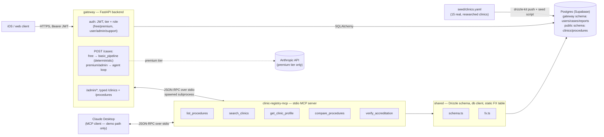

# MediTourBuddy

An information platform for Canada-outbound medical tourism (dental vertical v1: Turkey and
Mexico). Two halves: a **gateway** (`gateway/`) — a FastAPI backend with auth, tiers, and roles
that iOS/web clients call — sitting in front of the **`clinic-registry-mcp`** MCP server, which is
the portfolio centerpiece: an MCP server backed by a Postgres database of real,
individually-researched clinics where every accreditation claim carries a source URL a human can
check.

> Informational only — not medical advice. Verify directly with the clinic. (This disclaimer is
> baked into every MCP tool response and every gateway `Report` — see [Guardrails](#guardrails).)

## Demo

_A 30-second GIF of Claude Desktop calling the MCP tools directly goes here — see
[docs/architecture.md](docs/architecture.md#recording-the-demo-gif) for how to record it once
you've connected the server to Claude Desktop (below). This is a standalone demo path, separate
from the gateway's production use._

## Architecture



Three workspace packages, plus the gateway:

- **`gateway/`** — FastAPI backend, the only thing client apps talk to. JWT auth (register/login/
  logout/password-reset via email), a `tier` (free/premium) and independent `role` (user/admin/
  support — support is scoped for future use) per account, and one unified `POST /cases` endpoint
  that branches server-side: free tier runs a deterministic, zero-Anthropic-token pipeline
  (`app/services/basic_pipeline.py`); premium (and admin, unconditionally) runs a real multi-round
  Claude tool-use loop against the MCP server (`app/services/orchestrator.py`). Full endpoint
  reference: [`gateway/API_EXAMPLES.md`](gateway/API_EXAMPLES.md). Deployed on Fly.io.
- **`packages/shared`** — the Drizzle ORM schema (`clinics`, `accreditations`, `practitioners`,
  `procedures`, `clinic_procedures`, `reviews_summary`), a Postgres client, a static currency
  conversion table (`fx.ts`), and the seed pipeline (`src/seed/`) that loads
  `seed/clinics.yaml` into the database idempotently.
- **`packages/clinic-registry-mcp`** — the MCP server itself. Each tool is a small handler
  function in `src/tools/`, registered on an `McpServer` (`src/server.ts`) and exposed over
  `StdioServerTransport` (`src/index.ts`). The gateway spawns this as a subprocess in production;
  it's also connectable directly to Claude Desktop for the standalone demo (below).
- **`packages/agent`** — superseded by `gateway/app/services/orchestrator.py`; not built as a
  separate CLI.

## Tools (MCP server)

All inputs are Zod-validated; every response includes the disclaimer string above, and
price-bearing fields carry a `stale: true` flag once their `last_verified` date is more than 90
days old.

| Tool | Purpose | Key inputs |
|---|---|---|
| `list_procedures` | Reference lookup of the 12 seeded dental procedures, so free-text intake ("redo my whole top row") can be mapped to a `procedure_code`. | `category?` |
| `search_clinics` | Find vetted clinics for a case. Never returns a clinic with zero accreditations when `require_accreditation` is true (the default); sorted by accreditation strength, then price; capped at 10 results. | `procedure_code`, `country?`, `max_budget_usd?`, `language?`, `require_accreditation?` |
| `get_clinic_profile` | Full detail for one clinic: accreditations (with `source_url`), practitioners, priced procedures. | `slug` |
| `compare_procedures` | Cross-clinic USD price comparison for one procedure, optionally against a Canadian quote (`savings_vs_quote_pct`). Currency conversion uses the static table in `packages/shared/src/fx.ts`. | `procedure_code`, `canadian_quote_cad?`, `country?` |
| `verify_accreditation` | The trust tool — returns the evidence chain (`source_url`, `valid_until`, `status`) for a clinic's accreditations, not just a boolean. `status` is `verified`, `expired`, or `unverifiable` (no matching accreditation on file). | `slug`, `body?` |

Client apps don't call these directly — the gateway wraps `search_clinics`/`get_clinic_profile`/
`list_procedures` in typed REST routes (`GET /clinics/search`, `GET /clinics/{slug}`, `GET
/procedures`) and the rest inside the agent loop. Raw tool access (`GET /mcp/tools`, `POST
/mcp/call`) is admin-only, for debugging tools that don't have a typed wrapper yet.

## Gateway API (summary)

Full request/response examples, error shapes, and a curl walkthrough:
[`gateway/API_EXAMPLES.md`](gateway/API_EXAMPLES.md).

| Group | Endpoints | Notes |
|---|---|---|
| Auth | `POST /auth/register`, `/login`, `/logout`, `GET /auth/me`, `DELETE /auth/me`, `POST /auth/password-reset/request` + `/confirm` | Registration requires `consent_accepted: true`. Password reset is a 6-digit code emailed via Resend. |
| Cases | `POST /cases`, `GET /cases`, `GET /cases/{id}`, `DELETE /cases/{id}` | One endpoint, both tiers — response shape is identical, `report.report_tier` tells you which engine ran. Free: 10/day quota, 1-case history. Premium: 10 agent runs/month. Admin: no quota, no history cap, plus a `preview_tier` override to demo either report shape on demand. |
| Clinics/procedures | `GET /procedures`, `GET /clinics/search`, `GET /clinics/{slug}` | Typed wrappers around the MCP tools — clean JSON, no MCP envelope. |
| Admin | `GET /admin/users`, `GET /admin/users/{id}`, `GET /admin/users/{id}/cases[/{case_id}]` | Any user's profile and full case history, `role: "admin"` only. |
| Analytics | `POST /analytics/locked-card-tap` | Server-side signal for which locked (premium) feature free users tap most. |

## Guardrails

- Every tool/report is **information only**. Nothing recommends a treatment, interprets symptoms,
  or ranks clinics by clinical outcome — comparison is on price, accreditation, and logistics.
- Every accreditation row carries a `source_url`. No source, no row — enforced at the schema
  level (`accreditations.source_url` is `NOT NULL`) and honored during research: several real
  clinics in the seed data have **zero** accreditation rows because no verifiable claim could be
  found, rather than a fabricated one.
- Stale pricing (`last_verified` > 90 days) is returned with a `stale: true` flag.
- The disclaimer above is included in every MCP tool response and every gateway `Report`.

## Data

**15 clinics seeded** (8 Istanbul, 5 Los Algodones, 2 Cancún), hitting the original plan's target
(8 Istanbul, 7 Mexico) — every entry is a real clinic, individually researched, with sources cited
inline in [`packages/shared/seed/clinics.yaml`](packages/shared/seed/clinics.yaml).

## Running it locally

Prerequisites: Node 20+, Python 3.12+, [pnpm](https://pnpm.io), and a Postgres instance (either
Supabase, or a local one via Docker or Homebrew).

```bash
pnpm install
```

### 1. Point at a database

For Supabase, copy `.env.example` to `.env` and fill in your project's **Session pooler**
connection string (the direct `db.<ref>.supabase.co` host is IPv6-only and won't resolve on most
networks):

```bash
cp .env.example .env
```

For local development/testing, start Postgres via Docker...

```bash
docker compose up -d --wait
cp .env.test.example .env.test
```

...or Homebrew:

```bash
brew install postgresql@16 && brew services start postgresql@16
createdb meditourbuddy_test
echo 'DATABASE_URL="postgresql://localhost:5432/meditourbuddy_test"' > .env.test
```

### 2. Push the schema and seed data

```bash
set -a && source .env && set +a   # or .env.test, depending on target
pnpm db:push
pnpm db:seed
```

### 3. Run the MCP server's tests

```bash
set -a && source .env.test && set +a
pnpm --filter @meditourbuddy/clinic-registry-mcp test
```

The test suite's `globalSetup` (`packages/clinic-registry-mcp/test/global-setup.ts`) pushes the
schema and re-seeds automatically before running — no separate migrate step needed once
`DATABASE_URL` is exported.

### 4. Run the gateway (the API clients actually call)

The gateway spawns the MCP server as a subprocess, so build it first:

```bash
pnpm --filter @meditourbuddy/clinic-registry-mcp build
```

Then, from `gateway/`:

```bash
cd gateway
python3 -m venv .venv && source .venv/bin/activate
pip install -r requirements.txt
cp .env.example .env   # set JWT_SECRET, DATABASE_URL, ANTHROPIC_API_KEY, RESEND_API_KEY, MCP_SERVER_ARGS
uvicorn app.main:app --reload
```

The gateway's own tables (`users`, `cases`, `reports`, `password_reset_codes`) live in the
`gateway` Postgres schema, separate from the MCP server's `public` schema tables — same database,
no migration framework wired up (`gateway/migrations/*.sql` are plain, idempotent, hand-run
scripts; run them in order against your `DATABASE_URL`). See
[`gateway/API_EXAMPLES.md`](gateway/API_EXAMPLES.md) for a full curl walkthrough once it's up.

### 5. Run the gateway's tests

```bash
cd gateway && source .venv/bin/activate && pytest
```

## Deployment

The gateway is deployed on [Fly.io](https://fly.io) (`fly.toml` at the repo root — build from the
monorepo root so the multi-stage Dockerfile can reach both `gateway/` and `packages/`). It
compiles `clinic-registry-mcp` from source and bundles it with the Python gateway into one image,
so the MCP subprocess ships with every deploy — nothing separate to run. `auto_stop_machines =
"stop"` with `min_machines_running = 0` means genuinely $0 compute while idle; the app cold-starts
on the next request. Scaled to a single machine for this phase (`fly scale count 1`) — see
`fly.toml`'s inline comments for the tradeoff.

```bash
fly deploy                                    # from the repo root
fly secrets set JWT_SECRET=... ANTHROPIC_API_KEY=... RESEND_API_KEY=... DATABASE_URL=...
```

The MCP server itself isn't deployed standalone anywhere — production traffic only reaches it as
the gateway's subprocess. Connecting it directly to Claude Desktop (below) is a separate, local-only
demo path.

## Connecting to Claude Desktop

```bash
pnpm --filter @meditourbuddy/clinic-registry-mcp build
```

Then add to Claude Desktop's config (macOS:
`~/Library/Application Support/Claude/claude_desktop_config.json` — merge this into the existing
JSON rather than overwriting the file, it likely already has other keys):

```json
{
  "mcpServers": {
    "clinic-registry": {
      "command": "/absolute/path/to/node",
      "args": ["/absolute/path/to/meditourbuddy/packages/clinic-registry-mcp/dist/index.js"],
      "env": {
        "DATABASE_URL": "postgresql://..."
      }
    }
  }
}
```

Use an **absolute path to `node`** (`which node`), not just `"node"` — Claude Desktop is a GUI
app and won't have your shell's `PATH`, so an `nvm`-managed (or similarly version-managed) `node`
silently fails to spawn otherwise.

Restart Claude Desktop, then try: *"Find me an accredited all-on-4 clinic in Istanbul under $8K."*
This is verified working end-to-end (confirmed via a real MCP client connecting exactly the way
Claude Desktop does — same command, same args, same env — before writing this section).

## Project docs

- [`gateway/API_EXAMPLES.md`](gateway/API_EXAMPLES.md) — full gateway API reference: every
  endpoint, real captured request/response examples, error shapes, curl walkthrough. The most
  up-to-date doc in the repo — start here for anything gateway-related.
- [`docs/spec.md`](docs/spec.md) — the MCP server's original spec: data model, tool contracts,
  build order.
- [`docs/architecture.md`](docs/architecture.md) — MCP server component breakdown and data flow
  in more detail. Predates the gateway; MCP-server-specific content only.
- [`gateway/README.md`](gateway/README.md) — predates the real auth/tiers/roles build-out
  described above; `gateway/API_EXAMPLES.md` is the accurate reference in the meantime.
